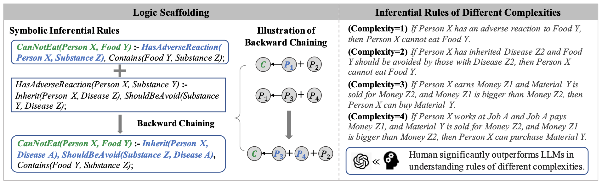

# Can LLMs Reason with Rules? Logic Scaffolding for Stress-Testing and Improving LLMs [[Paper]](https://arxiv.org/abs/2402.11442)



This repository hosts the codes of our logic scaffolding inferential rule generation framework for primitive rule generation and rule composition, and the data of our generated inferential rule base ULogic. 

## Running the project
You can directly run `primitive_rule_pipeline.ipynb` script for primitive rule generation and `rule_composition.ipynb` for rule composition.

## Dataset
`Data/ulogic.json` provides all inferential rules generated by our framework while `Data/probing_subset.json` provides a high-quality author verified subset of ULogic for rule probing of LLMs.
Each rule is formatted as following:
 ```json
   {
     "context": "Your context here",
     "question": "Your question here",
     "answer": "Your answer here"
   }
   ```

## Demo
We provide a [demo](http://210.16.188.56:59998) for our inference engine.

## Authors and Citation

This study was authored by Siyuan Wang, Zhongyu Wei, Yejin Choi and Xiang Ren. We encourage the use of our code and data in your research and kindly request citation of our paper as follows:

```BibTeX
@article{wang2024can,
  title={Can LLMs Reason with Rules? Logic Scaffolding for Stress-Testing and Improving LLMs},
  author={Wang, Siyuan and Wei, Zhongyu and Choi, Yejin and Ren, Xiang},
  journal={arXiv preprint arXiv:2402.11442},
  year={2024}
}
```
